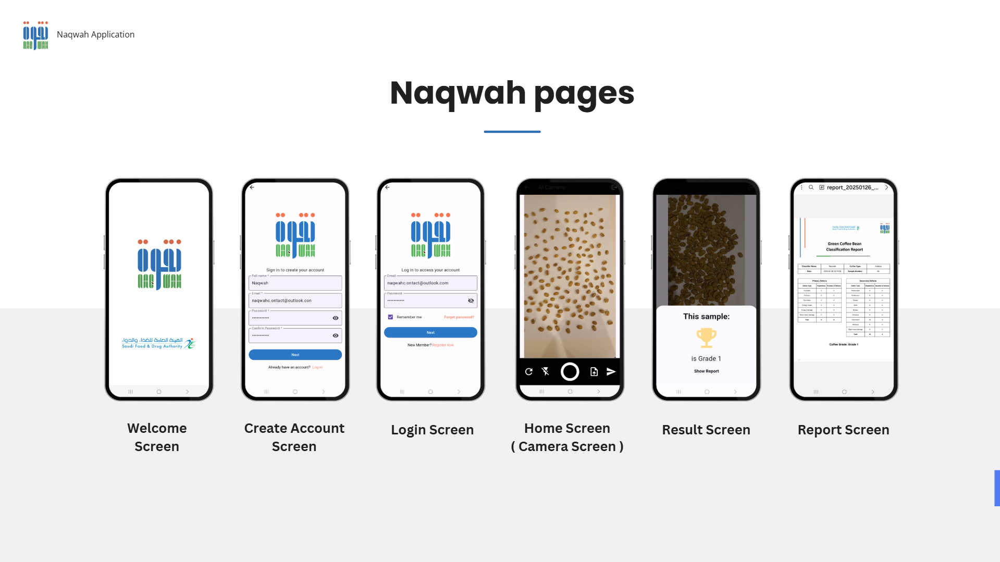

  

# Naqwah – AI-powered Coffee Bean Quality Assessment App ☕

**Naqwah** is a mobile application that leverages **YOLOv8 object detection** to **automate the grading of coffee beans**.  
This project was developed as my **graduation project** for the **Computer Science program at Imam Mohammad Ibn Saud Islamic University**.

---

## 🎯 Project Objective

Manual inspection of coffee beans is time-consuming, subjective, and prone to inconsistencies.  
**Naqwah** solves this by offering an automated, AI-based solution that:

- Detects and counts 16 types of coffee bean defects + 1 "Good" category.
- Grades coffee quality based on **Saudi Food and Drug Authority (SFDA)** standards.
- Generates an automatic PDF inspection report.
- Streamlines quality control with high accuracy and minimal human effort.

---

## 🛠 Tools Used

- **Figma** (UI/UX Design)  
- **Flutter** (Frontend)  
- **YOLOv8** (AI Model)  
- **FastAPI** (Backend)  
- **MySQL** (Database)  
- **Render & Railway** (Deployment)  

---

## 🧾 Features

- Upload image of coffee beans for real-time detection
- View total number of defects per image
- See assigned grade based on SFDA standards
- Automatically generated PDF report (excluding images)
- Fast, accurate, and consistent quality inspection

---

## 📱 App Screenshots

  

---

## 🧠 Model Overview

- 🔍 Detection Model: YOLOv8 (Ultralytics)
- 📦 Dataset: Custom-labeled dataset following SFDA defect categories
- 🧪 Evaluation Metrics: mAP, Precision, Recall, F1-Confidence, Confusion Matrix

---

## 📈 Model Performance Summary

### 🔹 Training & Validation Highlights

| Metric              | Training Trend               | Validation Trend                |
|---------------------|------------------------------|----------------------------------|
| Box/Class/Object Loss | Consistent decrease         | Low & stable                     |
| Precision           | High, increasing to ~1.0     | High (~0.9+)                     |
| Recall              | Gradual increase             | Slightly lower than precision   |
| mAP50               | —                            | **Above 0.9**                    |
| mAP50-95            | —                            | **~0.7 – 0.8**                   |

### 🔹 Confusion Matrix Accuracy

- ✅ **Perfect Accuracy (1.00)**: Broken, Dry Cherry, Good, etc.
- 🟡 **Some Confusion**: Foreign Matter, Partial Sour, Background
- 📌 Suggests potential improvement with more augmentation and clearer labeling.

### 🔹 F1-Confidence Curve

- **Best F1-score**: 0.98 at **confidence threshold 0.431**
- Indicates optimal balance between precision and recall.

---

## 🏆 Achievements

- 🥇 **1st Place Winner** at the **Computer Science Department Projects Exhibition**.

---

## 🚫 Source Code

> This repository is intended for **demo and showcase purposes only**.  
> **The source code is not publicly available.**
